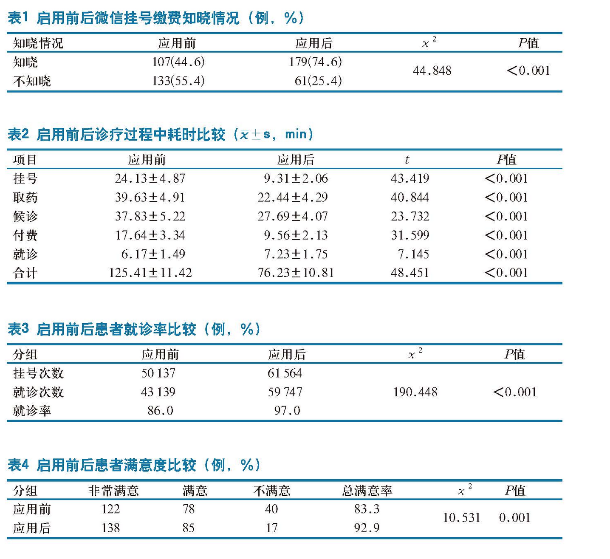

title: 从支付方式演变看患者就医体验
speaker: wanghaisheng
plugins:
    - echarts

<slide class="bg-black-blue aligncenter" image="https://source.unsplash.com/C1HhAQrbykQ/ .dark">

# 从支付方式演变看患者就医体验 {.text-landing.text-shadow}
现金、刷卡、app、社保、商保       

By wanghaisheng {.text-intro}

[:fa-github: Github](https://github.com/ksky521/nodeppt){.button.ghost}

<slide>
ref

https://www.cn-healthcare.com/articlewm/20180706/content-1028945.html       
https://github.com/wanghaisheng/finance-option-for-patient-and-hospital

理想中的挂号大厅

并实行“先诊疗、后付费”，建档立卡贫困人口住院凭健康扶贫服务卡无需缴纳住院押金，出院时实现基本医保、大病保险、医疗救助等“一站式”信息交换和即时结算，患者不需跑路，只需支付自付费用。

原国家卫生部2010年1月发出《关于进一步改善医疗机构医疗服务管理工作的通知》，要求各地简化门急诊服务流程，积极稳妥推行“先诊疗，后结算”模式。
　　
　　而在2013年1月，《卫生部关于印发2013年卫生工作要点的通知》卫办发〔2013〕5号中提及了当年的卫生工作要点，其中明确指出：“规范推进多种支付方式改革，有效控制医疗费用不合理增长，提高受益水平。强化新农合基金监管。开展先诊疗后付费模式试点、即时结报等便民服务。” 

先付费后看病

<slide class="bg-apple aligncenter">

## 门诊案例-某县人民医院     

--------
:::card

---

* 筹不到医药费看不了病       
不但给患者造成经济压力和精神压力，也会延误治病的最佳时机
* 诊治结束之后需患者自行携带相关资料去医保部门报销     
给患者带来了额外的麻烦，增加患者的负担，影响整体的就医体验
* 多次排队、往返缴费
* 先付费再诊疗，付了什么费用进行什么治疗     
如果需要其他治疗，则需要再次进行排队付费，
:::

<slide class="bg-apple aligncenter">

## 门诊案例-北京大学人民医院     

--------
:::card

---
* 2009年
* 预付费模式和传统付费模式并存           
自由选择、自由切换、余额不足需重新缴纳
* 科学测算指导价          
不同科室、不同人群、不同病种的门诊次均费用
* 预付费就诊卡实名制建卡
* 押金的支付方式        
现金、支票、信用卡、借记卡
* 医保vs患者自费部分      
实时结算扣除vs押金中扣除
:::

:::note

通过预缴一定额度押金的方式，待所有诊疗过程结束后统一进行结算，无需在接受每项诊疗服务时往返于各楼层之间单独缴费，这种“一站式”结算的支付方式
http://pkunews.pku.edu.cn/xwzh/2010-05/17/content_174772.htm

:::

<slide class="bg-apple aligncenter">

## 住院案例-济宁市兖州中医院     

--------
:::card

---
* 2010年
* 签订费用结算协议书       
新农合、居民和职工医疗保险           
提供医保证和身份证     
* 出院结算自费支付        
可以和医院签订还款协议，1～2年内还清即可
:::

:::note
实施半年多以来，医院门诊人次、住院人数均同比翻了一番以上，业务收入增幅达120%，全年业务收入预计将比两年多前翻两番

:::

<slide class="bg-apple aligncenter">

## 门诊案例-赣州市人民医院
--------
:::card

---
* 2018年
* 办理就诊卡
* 医院微信公众号、支付宝服务窗、医院网站、医院综合一体机等渠道进行就诊预约，预约成功后可按预约时间直接到各诊区分诊候诊。
* 就诊结束后，患者可通过医院微信公众号、医院综合一体机等渠道进行线上缴费
:::

:::note
http://jx.ifeng.com/a/20181202/7071408_0.shtml
:::

<slide class="bg-apple aligncenter">

## 门诊案例-贵航三〇〇医院
--------
:::card

---
* 2017年
* 建卡
* 取号就诊，不交挂号费           
把挂号、收费这一程序给‘省’了。”
* 漏费      
儿科2017.11月就诊人数5683人次，没有缴费的有520人次，在9.15%的漏费里面，45%是专家号漏费，55%是普通号漏费。    
看完病以后，诊断明确了，开的药家里都有，病人就没必要再给钱去拿药          
打电话给病人进行提醒缴费(未实现)
* 门诊人流量增加了     
每天增加差不多200~300名
* 门诊病人的就医好感度提高了。
:::

:::note
http://www.sohu.com/a/220101406_617717
:::

<slide class="bg-apple aligncenter">

## 门诊案例-广东省人民医院
--------
:::card

---
* 2018年
* 实现线上+线下多方式诊疗全功能：     
微信公众号／支付宝生活号／app／自助机
* 预约-自助机/分诊台报到——候诊——就诊       
* 医保移动支付(不支持门特、门慢、住院)      
微信/支付宝实名认证社保卡         
微信公众号、自助终端机、手机扫码支付        
月均8万人使用互联网支付 医保占10%
* 医保患者缴费时间减少2/3。
* 
:::

:::note
http://static.nfapp.southcn.com/content/201804/05/c1073330.html?from=groupmessage
:::

<slide class="bg-apple aligncenter">

## 门诊案例-广东云医院
--------
:::card

---
* 2017年
* 12家医院已正式上线“信用就医”。其中包括广州医科大学附属第二医院、广州医科大学附属第一医院、中山大学附属第六医院、广州中医药大学第一附属医院、暨南大学附属第一医院、广州市第一人民医院、广州市红十字会医院、广东药科大学附属第一医院、珠海市人民医院、广州市第十二人民医院、广州市番禺区何贤纪念医院、连州市人民医院。
* 芝麻信用650分以上的花呗用户，在支付宝生活号内搜索“广东云医院”或在广东云医院APP上成功开通“信用就医”后，可获得由花呗额外提供的1000元就医额度

* “信用医疗”是无需诊间支付。用户挂号，就诊、检查、取药等环节，免去以往反复排队缴费的烦恼，就诊完成后即可离院，诊间费用均将在线上自动结清。
* 后续将在住院全流程服务上发力，并逐步接入人脸识别、大额医药费分期付款、个人金融贷款等功能及服。

:::

:::note
http://sh.qihoo.com/pc/2s1com7pm13?sign=360_e39369d1
:::

<slide class="bg-apple aligncenter">

## 门诊案例-富阳
--------
:::card

---
* 2018年
* “最多付一次”
* 覆盖富阳区6家公立医院、25家社区服务中心及154家卫生服务站
* 门诊大厅签订《先看病后付费服务结算协议书》
* 凭杭州市民卡、居民身份证、电子健康卡、电子社保卡即可
* 钱江分达到550分以上，便无需排队挂号及付费，可直接预约就诊、检查、取药，只需在离开医院48小时内，一次性完成付费。
* 初始授信额度从原来的300元提高到500元，并依据钱江分的增高而相应递增，门诊最高授信额度达5000元（住院信用额度维持在1.5万元不变），

:::

:::note
* 据统计，光是在富阳,目前就有78万人拥有钱江分，其中，约75万人的钱江分在550分至650分之间，平均授信额度达700元至750元。

 https://hzdaily.hangzhou.com.cn/hzrb/2018/12/29/article_detail_1_20181229A108.html
:::

<slide class="bg-apple aligncenter">

## 门诊案例-深圳中医院
--------
:::card{.bg-apple}

---
* 2017年 

* 支付宝 中国太保寿险

* 支付宝开通“商保快赔”，点击“申请理赔”

* 2016开通医保移动支付        
让患者可以享受“医保+自费”的一键支付

:::

:::note

:::

<slide class="bg-apple aligncenter">

## 门诊和住院案例-深圳市商保便民服务平台
--------
:::card-60{.bg-apple}

---
* 2018.12    

* 健康深圳app   

* 操作步骤：       
确认实名身份             
选择就诊信息      
绑定银行卡       
理赔申请 

* 深圳市人民医院     
* 北京大学深圳医院
* 深圳市第二人民医院
* 深圳市罗湖区人民医院

* 乐约健康技术

:::

:::note
有数据显示，2017年全国发生健康险保险理赔案高达7200万件，较前一年增长30%。广医二院商保快赔平台技术支持方、乐约健康总裁付新华对记者说，与健康险数据快速增长形成鲜明对比的是，商业保险所表现出来的购买容易，但理赔难、报销慢、手续繁琐等问题已经成为一个同时横在老百姓、医院、保险公司三者之间的“鸿沟”。

“理赔难，其实就是医院、保险公司之间的数据连接难。”付新华介绍说，全国有149家保险公司，险种超过了4000种，而每家保险公司对理赔数据的标准和要求各异，结算环节复杂，风控标准不一，所以导致健康险理赔结算流程慢、手续多、时间长，有时候可能需要二三十天，用户体验很不爽。

而要让149家公司4000多种保险去一家一家对接全国上万家公立医院，这几乎是不可能完成的任务。作为第三方平台，乐约健康一端对接多家保险公司，另一端对接各家医院，从最核心的数据流和业务流对接入手，打破保险和医疗之间的信息壁垒，将传统线下理赔的“手动模式”升级为在线结算的“自动模式”，为商保患者理赔提供一站式便捷结算服务，极大优化医院服务流程，提高了医疗服务效率。
:::

<slide class="bg-apple aligncenter">

## 门诊案例-深圳市南山医院和南通市妇幼保健院
--------
:::card{.bg-apple}

---

* 2017
* 众安(3年内直连医院达2500 家)
* 先完成社保和自费部分缴费
* 医院的微信公众号
* 操作步骤       
选择“商保理赔”功能     
点击“申请理赔”       
提交理赔信息        
选择就诊记录即可     
可通过公众号随时查询理赔审核进度。

:::

<slide class="bg-apple alignleft">

## 门诊+住院案例—武汉中心医院
--------
:::card{.bg-apple}

---
* 2016
* “医保+商保+自费”一站式综合支付
* 住院门诊皆可
* 武汉市中心医院APP   
* 操作步骤：    
点击“费用缴纳”选项，显示了具体的检查项目及药品费用清单，      
点击“立即支付”选项，显示了“医保+商保”支付项目，      
勾选确认保险公司后，便输入银行账号，在线签约授权，完成个人身份验证。
* 泰康、平安
* 上线一年,已完成近300笔商保直赔     
门诊病人的理赔时间在20秒以内       
住院病人的理赔时间在1分钟以内
:::
:::note
http://www.cnki.com.cn/Article/CJFDTotal-YISZ201712003.htm
:::

<slide class="bg-apple aligncenter">

## 社区卫生服务中心案例-北京常营

--------
:::card

---
* 2015年
* 172家/335社区卫生服务中心
* 建卡(医保卡或健康卡)
* 取号就诊，不交挂号费           
把挂号、收费这一程序给‘省’了。”
* 放射、化验这些检查项目还是需要先付费再诊疗的
* 跑费的患者，但数量极少          
在社区看病的绝大多数患者是社区居民，并非看一次病就不来了
* 2017年5月门急诊挂号人数为26531人，较去年同比增加22.6%；      
医疗收入144万元，较去年同比增长47.65%；      
总收入641万元，较去年同比增长10.03%。     
:::

:::note

首次到该中心就诊或需要建立健康档案、家庭签约、老年人体检等基本公共卫生服务的患者，将从取号机上取得“服务号”，等候叫号，完成上述流程。

就医过程中没有收取的费用将在药房取药时统一结算
https://www.cn-healthcare.com/articlewm/20170531/content-1014955.html

:::

<slide class="bg-apple" :class="size-70 frame">

## 患者服务-费用来源{.text-serif.aligncenter}

-----------
<nav class="aligncenter">
* [:fa-th-large: 现金]()
* [:fa-tv: 银行卡(储蓄卡+信用卡)]()
* [:fa-magic: 社保+新农合]()
* [:fa-cube:  商业保险]()
* [:fa-cube:  信用付]()

{.no-list-style}

</nav>

<slide class="bg-apple" :class="size-60 frame">

## 患者服务-患者自助{.text-serif.aligncenter}

-----------
<nav class="aligncenter">
* [:fa-th-large: 窗口]()
* [:fa-tv: 自助机]()
* [:fa-magic: 第三方APP]()
* [:fa-magic: 微信支付宝]()

{.no-list-style}

</nav>

<slide class="bg-apple aligncenter">
## 患者服务-多途径多渠道支付

--------------
:::column
## 人工窗口{.alignleft}

* 现金支付
* pos机刷卡支付        
社保卡、新农合、银行卡、信用卡、商保卡、其他充值功能的卡片
------
## 线上支付{.alignleft}

* 公众号/生活号/app推送支付
* 诊间微信/支付宝/银联/app扫码支付
* 线上充值
--------
## 线下支付{.alignleft}

* 微信/支付宝/银联主动扫码支付
* 微信/支付宝/银联被动扫码支付
* 自助机充值
现金、刷卡、移动
* 自助机缴费
现金、刷卡、移动扫码、移动刷脸

<slide class="bg-apple aligncenter">

## 模式优劣势
一站式结算+一站式支付   

:::column

事前结算+事前支付

传统模式

先付费，后诊疗

-----

事前支付+事后结算 

押金 社会保险 商业保险   

先诊疗，后付费

-----

事后结算+事后支付 

信用付

先诊疗，慢慢付

:::

:::note
一是预存诊疗，结束后进行费用的一次性结算，称之为后结算型;(只需患者在就诊的时候提供与就诊卡绑定的银行卡，预存费用到银行卡里，通过控制绑定就诊卡的银行卡避免患者逃费，适用于所有患者)
二是不交钱也不预存钱直接进行诊疗，待诊疗结束后一次性结算不同渠道应该承担的份额,并完成医保+自费+商保的一站式支付，
a社保移动支付+a自费信用付+a商保移动支付>
a社保移动支付+a自费移动支付+b商保移动支付>
a社保移动支付+a自费移动支付+商保线下支付>
a社保移动支付+a自费移动支付+a商保移动支付>

a社保移动支付+a自费移动支付+b商保移动支付>
a社保移动支付+a自费移动支付+商保线下支付>

社保线下支付+自费线下支付+商保线下理赔>

通过一卡通预缴一定额度押金的方式
绑定支付账户(信用卡、支付宝、商保会员卡)

押金缴纳  窗口vs自助机
就诊卡绑定银行卡

，实施“先诊疗后付费”模式的医疗机构，患者在诊疗全程中的就诊时间可有效节约25%～30%，往返付费诊疗的排队次数可由平均3次减少到1次
不论患者的经济状况如何，医疗机构都可以按照程序首先提供平等的医疗服务;患者不会因为筹集不到足够的资金而得不到及时的治疗，提高了医疗卫生服务的及时性;患者只需在诊疗结束后缴付医保报销后个人承担的那一部分费用，减轻了患者就诊的经济压力
通过规范诊疗服务，提高了医疗质量;通过优化医疗服务流程，规范诊疗过程;实施的效果得到了社会的认可，改变了医院的形象;其模式强化了 社 会 职 能，使得医院服务能力得到提升。实行“先诊疗 后 付 费”模 式 有 利 于 医 院 对 人 力 资 源 进行优化，减轻医疗服务工作人员的工作压力，节约人力资源成本，提高服务效率，从而使医院服务能力得到提升。
意味着在治疗的过程中医院把付款的主动权完全交给了患者，这是对病人的尊重和信任，体现出了公立医院的公益性，有利于改善医患关系

该模式能否推广取决于三个方面，“一是医疗保障制度的覆盖面和筹资水平，覆盖面越广，医疗费用实际报销水平越高，推广的可行性越好;二是当地居民的信用水平，诚信度越高，推广的可行性越好;三是当地经济发展水平，经济发展水平越高，人们的实际支付能力越强，出现恶意欠费的现象越少”

缺点
社会诚信问题(用法律打击不诚信)
目前三种医保的统筹层次、筹资水平、保障力度不同，造成了异地结算困难的问题
医保支付的延迟增加了医院垫付资金的压 力，使得医院面临着资金周转困难的问题（每年 度 医 保 部 门 可 以 根 据 上 一 年 度 资 金使用情况向医院预付部分资金，把医保基金预付制和个人后付制有机结合）
https://baike.baidu.com/item/%E2%80%9C%E5%85%88%E7%9C%8B%E7%97%85%E5%90%8E%E4%BB%98%E8%B4%B9%E2%80%9D%E5%88%B6%E5%BA%A6/5945501

:::

<slide class="bg-apple" :class="size-60 frame">

## 移动支付四部曲{.text-serif.aligncenter}

-----------
<nav class="aligncenter">
* [:fa-th-large: 自费移动支付]()
* [:fa-tv: 社保移动支付]()
* [:fa-magic: 自费信用付]()
* [:fa-cube:  商保移动支付]()
      

{.no-list-style}

</nav>

<slide class="bg-apple aligncenter">

## 理想中的就医流程
-------
 )

<slide class="bg-apple aligncenter">

## 混乱的世界
-------
* a社保移动支付+a自费信用付+a商保移动支付 优于      
* a社保移动支付+a自费移动支付+b商保移动支付 优于     
* a社保移动支付+a自费移动支付+商保线下支付 优于     
* a社保线下支付+a自费线下支付+a商保线下支付 

<slide class="bg-apple alignleft">

## 自费移动支付    多少城多少医院  
破解看病难(支付便利性)

:::note
## 存在的问题。

* 患者付款环节遇到医保支付时，大部分仍然选择线下支付。
* 自费患者使用率达到50%，但只有13.2%的挂号费和2.8%医疗费通过线上的系统
:::

<slide class="bg-apple alignleft">

# 移动医保支付  多少城多少医院
破解看病难(医保患者是大头)

## 深圳：

2016年6月，在全市开展医疗保险移动支付工作试点，以发行金融社保卡为契机，依托第三方支付机构的实名认证体系，建立统一的绑卡、快捷支付结算平台。

## 武汉：

2017年11月，由武汉市人力资源和社会保障局联合支付宝、汉口银行打造的武汉市医保移动支付平台正式上线，目前暂时仅支持城镇职工医保线上支付。

## 福州：

2018年4月，省本级参保人员在省本级各定点零售药店购药时不带医保卡可直接通过移动支付完成医保个人账户购药。

::::note

现有的医保移动支付模式更强调支付环节的形式：绑定手机、密码支付、短信验证、指纹支付、人脸支付……在支付的便捷性上下足了功夫，而回避了医保的本质——保障参保人的就医行为。

医保脱卡支付安全有两个概念：一是系统安全，即脱卡支付系统防攻击能力够不够强。二是医疗服务流程安全，即确保医保保障的是参保人本人的就医行为，这就要求对医院/医生端与患者端的行为同时进行监控。现有的系统大多可以实现在医院/医生端设置环节来监管医生的行为（DRG，处方的阳光点评等）。但在患者端，监控很难实现。

医保移动支付是要在保证基金安全与医疗安全的前提下，为老百姓提供便捷的医保结算支付服务，在整个过程中，确定本人就医是关键，身份识别是出路。意识到这个问题后，邵逸夫医院进行了更深一步的实践，启用了现场身份识别信息采集和认证。即：现场采集参保人人像、指纹等身份信息，并借助AI技术与社保卡上的身份信息进行智能匹配，保证实人实名认证；就诊时，诊疗身份识别系统自动识别患者身份，保证就医人是“本人”。邵医认证系统实践效果良好，也存在一些问题亟待解决，一是成本较高，需要医院改造诊间系统，二是身份识别信息采集成本高，且不能跨院使用。

想要彻底解决身份识别问题，需要部门联合采集（人社、公安、金融、民政、卫生等）居民身份信息，在确保信息安全的基础上，内部信息共享，利用人工智能、区块链、大数据等技术，建立一个全国性或区域性“居民身份信息库”。当人脸识别的时代到来时，全民人脸看病、医保移动支付的时代才能到来。
:::

<slide class="bg-apple alignleft">
## 信用付  多少城多少医院
破解看病贵(减轻自费患者负担)       

:::note

线下：问诊、检查、处置、取药       
线上：
其中有一个问题是跟医院的相关性很大，即：医院就诊服务的节点多。按照传统的思维方式，每个节点都是需要排队的。由传统思维产生的传统就医流程就是，门诊平均排队次数差不多需要八次，缴费需要三次（见下图）。在这样的流程下，患者去医院看病，难免会发生“排队两小时，看病五分钟”看病难的情况。
:::

<slide class="bg-apple aligncenter">

https://www.jianshu.com/p/b9737ce4f149

<slide class="bg-apple aligncenter">
## 商保移动付  多少城多少医院

### 支付宝
深圳中医院
### 微信
众安保险
### 平安好医生

南医大深圳医院

### 微医

:::note
有数据显示，2017年全国发生健康险保险理赔案高达7200万件，较前一年增长30%。广医二院商保快赔平台技术支持方、乐约健康总裁付新华对记者说，与健康险数据快速增长形成鲜明对比的是，商业保险所表现出来的购买容易，但理赔难、报销慢、手续繁琐等问题已经成为一个同时横在老百姓、医院、保险公司三者之间的“鸿沟”。

“理赔难，其实就是医院、保险公司之间的数据连接难。”付新华介绍说，全国有149家保险公司，险种超过了4000种，而每家保险公司对理赔数据的标准和要求各异，结算环节复杂，风控标准不一，所以导致健康险理赔结算流程慢、手续多、时间长，有时候可能需要二三十天，用户体验很不爽。

而要让149家公司4000多种保险去一家一家对接全国上万家公立医院，这几乎是不可能完成的任务。作为第三方平台，乐约健康一端对接多家保险公司，另一端对接各家医院，从最核心的数据流和业务流对接入手，打破保险和医疗之间的信息壁垒，将传统线下理赔的“手动模式”升级为在线结算的“自动模式”，为商保患者理赔提供一站式便捷结算服务，极大优化医院服务流程，提高了医疗服务效率。

http://www.sz.gov.cn/szhpfpc/gsgg/201809/t20180930_14183029.htm
:::
<slide class="bg-apple alignleft">

## 商保+社保+自费 一站式移动支付{.aligncenter} 

多少城多少医院

:::note
多机构试水商保直赔
一、医疗机构
—华信医院
—北大肿瘤医院
—武汉市中心医院
一郑州市中心医院
—中国医科大一附院、
—大连医科大附属二院
一佛山市中医院
一海南省肿瘤医院
一天津市北辰中医医院
-南方医科大学深圳医院
—上海龙华医院
—溧阳市人民医院  基本医保+大病保险+商业补充保险
—阳光融和医院
—无锡八院
—泰心医院

区域
辽宁省人民政府发表文章称，“医疗商业保险理赔结算通道系统”正式上线。这意味着购买商业保险的患者可以享受“医疗+商保”线上支付，商业保险实现即时“秒赔”，患者不需要再提交病历、发票等纸质材料，由保险公司直接和医院进行实时结算。
二、技术服务商
一微医
—默联
—乐约
—卫宁
—平安好医生
—大象就医

三、保险公司
一泰康
一平安
一人保
一招商信诺
一众安保险
一信诫人寿
—太保安联
—中国人寿 医保通”
—中国人寿溧阳支公司
—国联人寿

::::

<slide class="bg-apple aligncenter">
## 商保刷卡付 多少城多少医院

### 易雍健康 河南

:::note
参保人只需前往易雍健康直接结算网络医院就诊，出院时中华保险和易雍健康已经核算出由商保理应赔付的那部分治疗费用，并直接与医院结算，参保人无需付费给医院，更无需进行事后理赔提交，真正达到像刷社保卡一样刷商保。

中华保险和易雍健康打造的“易雍支付”直接结算模式是健康险的一种全新支付形式，成为了一种信任背书，每年人均保费只需要500元，既保疾病又保意外，提供总额度高达100万的住院医疗及特殊门诊医疗保险金，让人们面对突如其来的大病，不再手足无措。
:::

<slide class="bg-apple aligncenter">

## 患者诉求和心理
------------
:::column 

## 去哪看

 熟悉 vs 踏实    

 距离近 vs  距离远   

 人多   vs  麻烦         
 
 急不急 vs 费时

-----

## 找谁看

 大专家                

 老熟人       

 普通大夫

-----

## 看得怎么样

疗效 成本 效率

舒服 热情 细心     

:::

<slide class="bg-apple aligncenter">

## 患者体验 vs 医疗服务价值
------------
:::column 

## 看得好       

医生诊疗水平      
设备     
医疗质量

-----

## 看得快
最多跑一次     
业务流程           
信息化手段

-----

## 看得便宜

费用清单    
医保报销      
商保报销      
自费    

------

## 看得满意
设施环境     
医患沟通     
个性化   
:::

<slide class="bg-apple aligncenter">

## 未来医疗大趋势

-----------
:::column
## :fa-cog:无纸化

* 电子就诊卡{.aligncenter}
* 电子医保卡{.aligncenter}
* 电子健康卡{.aligncenter}
* 电子发票{.aligncenter}
* 电子凭证{.aligncenter}
* 电子处方{.aligncenter}
* 电子胶片{.aligncenter}
* 电子病历{.aligncenter}

----

## :fa-cog:无窗口
* 线上全流程{.aligncenter}
* 线下自助机{.aligncenter}
* 线上与线上互通{.aligncenter}
* 全程移动支付{.aligncenter}
* 全程智能导医{.aligncenter}
* 全程移动预约{.aligncenter}
* 全程医保结算{.aligncenter}
* 全程室内导航{.aligncenter}
-----

### :fa-cog:无卡化

* 人脸识别建卡绑卡{.aligncenter}
* 人脸识别挂号{.aligncenter}
* 人脸识别预约登记{.aligncenter}
* 人脸识别缴费{.aligncenter}
* 人脸识别取报告{.aligncenter}
* 扫码识别技术{.aligncenter}
* 智能定位签到{.aligncenter}

-----

### :fa-cog:无现金

* 开通允许自动代扣{.aligncenter}
* 诊间直付{.aligncenter}
* 手机上自助完成{.aligncenter}
* 微信商保支付{.aligncenter}
* 医信付{.aligncenter}
* 支付宝信用支付{.aligncenter}
* 微信信用“支付分”{.aligncenter}
* 无需支付押金商保支付{.aligncenter}
:::